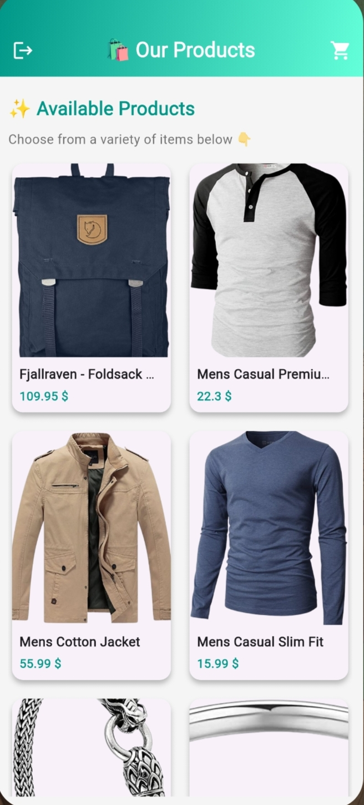
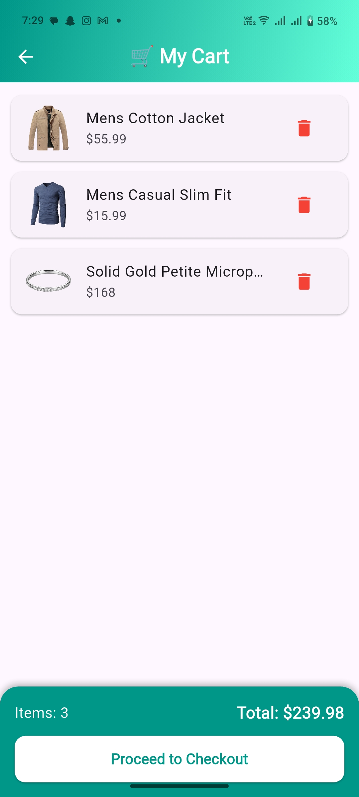

# 🛍️ Shoppy

A sleek, modern **Flutter shopping app** powered by **Supabase authentication** and **Provider state management**. Featuring a vibrant **teal gradient theme**, Shoppy delivers a delightful and intuitive shopping experience for users.

---

## ✨ Features

- **🔑 User Authentication**

  - Sign up with email and password
  - Secure login with email and password
  - Easy logout via AppBar button

- **🛒 Products Page**

  - Visually appealing product grid
  - Add items to cart with a single tap
  - Real-time cart badge with item count

- **🛍️ Cart Page**

  - View and manage added items
  - Track item quantities
  - Seamless navigation for a smooth user experience

- **🎨 UI/UX Highlights**
  - Elegant teal gradient AppBars
  - Clean, responsive, and beginner-friendly design
  - Well-organized project structure for easy contributions

---

## 🖼️ Screenshots

|               Login Page               |               Signup Page                |              Home Page               |              Cart Page               |
| :------------------------------------: | :--------------------------------------: | :----------------------------------: | :----------------------------------: |
|  |  |  |  |

---

## 🚀 Getting Started

Get Shoppy up and running on your local machine with these simple steps.

### 1. Clone the Repository

```bash
git clone https://github.com/your-username/shoppy.git
cd shoppy
```

### 2. Install Dependencies

Install the required Flutter dependencies:

```bash
flutter pub get
```

### 3. Set Up Supabase

1. Create a project on [Supabase](https://supabase.com).
2. Enable **Email/Password Authentication** in the project settings.
3. Update the Supabase configuration in `lib/services/services.dart` with your project credentials:

```dart
await Supabase.initialize(
  url: "https://your-project-url.supabase.co",
  anonKey: "your-anon-key",
);
```

### 4. Run the App

Launch the app on a connected device or emulator:

```bash
flutter run
```

---

## 📦 Build for Release

### Android (App Bundle)

Generate an Android App Bundle for release:

```bash
flutter build appbundle --release
```

### iOS

Create an iOS archive for release:

```bash
flutter build ios --release
```

---

## 🛠 Tech Stack

- **Frontend**: Flutter
- **State Management**: Provider
- **Backend/Authentication**: Supabase
- **Language**: Dart

---

## 🙌 Contributing

We love contributions to Shoppy! Here's how you can get involved:

1. 🍴 Fork the repository
2. ✨ Create a new branch for your feature or fix
3. 💡 Commit your changes
4. 🚀 Submit a Pull Request

Please ensure your code follows the project's coding style and includes relevant tests.

---

## 📄 License

This project is licensed under the **[MIT License](LICENSE)**.

---

**Made with ❤️ using Flutter**
